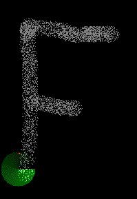
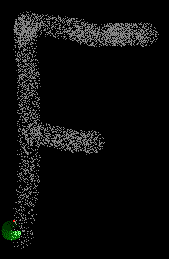
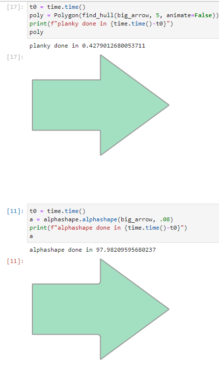

# Planky
This repo demostrates an algorithm for traversing 2D point cloud data in order to obtain a bounding polygon.


## Behavior
It can handle sparsity, but if the rod lenth is too short it can get stuck sometimes.



Here is an example of how it might break.




This is rare, enough that it can usually incrementing the rod length can usually solve the issue.

This is less of a problem with continuous volumes, though I have seen it happen once.

## Performance



The performance is roughly 100 times faster than alphashape. The lead does get larger with more points, so the complexity is better than alphashape, but isn't quite hitting the performance I think it should. I expected the growth to be roughly proportional to the length of the border (i.e. $\sqrt{N}$). Experimentally it does not quite reach that, but it is close.

`big_arrow.png` has roughly 17 times as many points as `arrow.png`, alphashape takes ~17 times as long on `big_arrow` which is in keeping with the reported $N\log{N}$ complexity. Planky takes roughly 6.5 times as long on `big_arrow`, which is not quite $\sqrt{N}$ (maybe it is memory read/write that is inflating this)

## DEVELOPMENT
- (If you don't have it already) Install `Mambaforge` from https://conda-forge.org/miniforge/ _(Anaconda is also fine)_
- Open up a conda terminal.<br>
    - From the start menu, search for `Anaconda` and `Anaconda Prompt (MambaForge3)` should pop up.
    - The terminal should look like this

```bash
    (base) C:\users\USERNAME>
```
- From within the terminal, navigate to the root folder that this document is in.

```bash
    cd PATH/TO/REPO
```